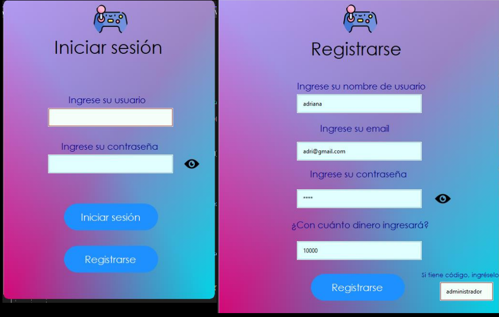
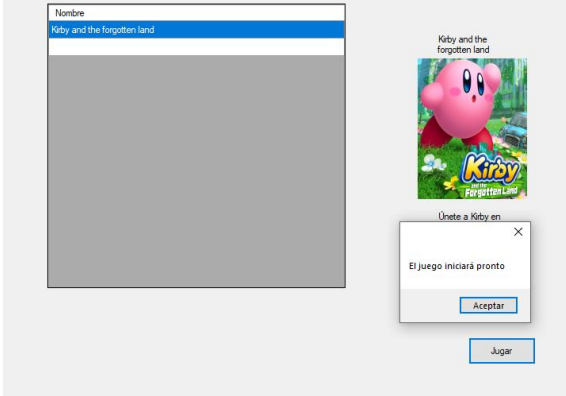

# Proyecto final de Taller de Bases de Datos

<h3>Acerca de...</h2>

Proyecto final de quinto semestre de Bases de datos (Bases de datos II), se usó SQL Server como Base de datos y C# como lenguaje principal.

